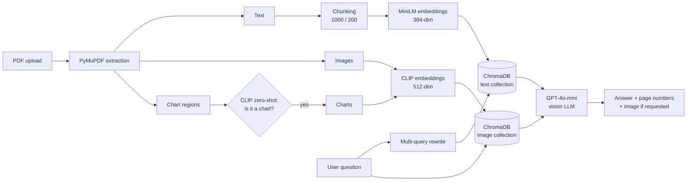

# 🔍 PDF Lens – AskMyPDF: Multimodal RAG System

Ask questions about any PDF and get answers built from its **text, images and charts/graphs**.

🔗 **Live demo:** https://pdf-lens-aemeo8imdlf2nxkqpj6p83.streamlit.app/

---

## ✨ Features

- 📄 **Upload any PDF** and ask questions in plain English
- 📊 **Understands charts and graphs**: explains what a bar chart, pie chart or line graph represents
- 🖼️ **Shows images on request**: "show me the bar chart" or "show the image on page 7"
- 🔁 **Multi-query retrieval**: handles different wording (e.g. *drawbacks* finds *disadvantages* / *limitations*)
- 📑 **Page citations** in every answer
- 🚫 **Honest answers**: politely says when the document does not contain the information

---

## 🏗️ Architecture



**How it works**

1. **Extraction:** PyMuPDF reads the text, embedded images and drawn chart areas from every page.
2. **Chart detection:** each picture area is cropped and classified with **CLIP zero-shot classification** (bar chart, pie chart, line graph, flowchart vs. photo, logo, table, text).
3. **Embeddings:** text chunks use **all-MiniLM-L6-v2** (384-dim); images and charts use **CLIP** (512-dim). Because the sizes differ, they are stored in **two separate ChromaDB collections**.
4. **Retrieval:** the question is rewritten into several search queries (multi-query retrieval) to find the right text chunks. CLIP turns the question into a vector to find the most relevant images.
5. **Generation:** the text chunks and images (as base64) are sent to **GPT-4o-mini**, a vision model, which answers with page numbers.

---

## 🛠️ Tech Stack

| Part | Tool |
|---|---|
| PDF parsing | PyMuPDF |
| Text embeddings | sentence-transformers/all-MiniLM-L6-v2 |
| Image embeddings & chart detection | OpenAI CLIP (ViT-B/32) |
| Vector database | ChromaDB |
| Framework | LangChain |
| LLM | OpenAI GPT-4o-mini (vision) |
| UI | Streamlit |

---

## 🚀 Run Locally

```bash
git clone https://github.com/<your-username>/pdf-lens.git
cd pdf-lens
pip install -r requirements.txt
```

Add your OpenAI key in `.streamlit/secrets.toml`:

```toml
OPENAI_API_KEY = "your_key_here"
```

Start the app:

```bash
streamlit run streamlit_app.py
```

---

## 📁 Project Structure

```
├── streamlit_app.py              # Streamlit web app (full RAG pipeline + UI)
├── multimodal_rag.ipynb  # notebook used to build and test the pipeline
├── requirements.txt
└── .gitignore
```

## 🔮 Future Improvements

- OCR for scanned PDFs
- Chat history / follow-up questions
- Hybrid search (keyword + vector)
- Support for multiple PDFs at once
